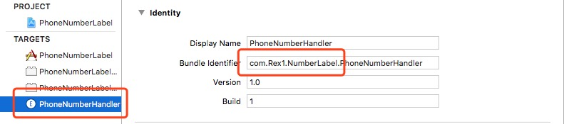
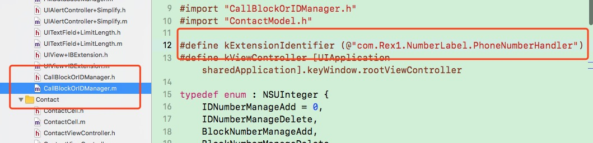
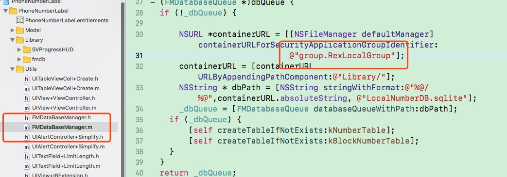

# CallKitDemo

A demo to show the intact process to add indentifications for phonenumber or block phonenumber

一个展示如何添加号码识别以及号码屏蔽的完整demo

# Tips

1. If the phonenumber is in your iphone contacts, the identification function is useless.
2. If block a phonenumber, you won't see the incoming call.
3. Open App Groups to shared the data between main App and the extension App. 
4. The phonenumbers add to CXCallDirectoryExtensionContext must have country code otherwise it's useless.
5. Before add to CXCallDirectoryExtensionContext, the phonenumbers need to sort by ascending and remove the duplicates.
6. The maximum quantity can be added between 1 and 2 million. I try to add 1 million succeeded but 2 million failed.
7. Currently we can only update it full amount but can't incremental updates.

##
1. 如果该号码已存在手机里，标记识别将会无效
2. 如果屏蔽某号码，看不到该号码来电
3. 打开主App和扩展App的数据共享，以实现两个应用共享数据
4. 添加到call表单中的电话号码必须带上国家区号
5. 添加号码到表单之前，需要对数据进行去重和升序排列
6. 最大数量在100万到200万之间，原因可能是超时无效
7. 目前好像只能全量更新数据，不能增量更新，效率比较低

# How to launch the Demo

well, you need modify some setting, make sure the demo can build in your iPhone.

1. MainApp BundleIdentifier and ExtentionApp BundleIdentifier

Rule -> "ExtensionApp_BundleIdentifier = MainApp_BundleIdentifier + ExtensionApp_TargetName"

And also don't forget modify this ExtentionApp BundleIdentifier in CallBlockOrIDManager.m

2. Database Path 

DB path use the App Groups name as a part, so you should change the name.
Click the "+" button to add your new own group, name should be "group.xxxxx".

____________________

It's easy to add to any app. 

很容易集成

[jianshu]http://www.jianshu.com/p/510c8da9848c
